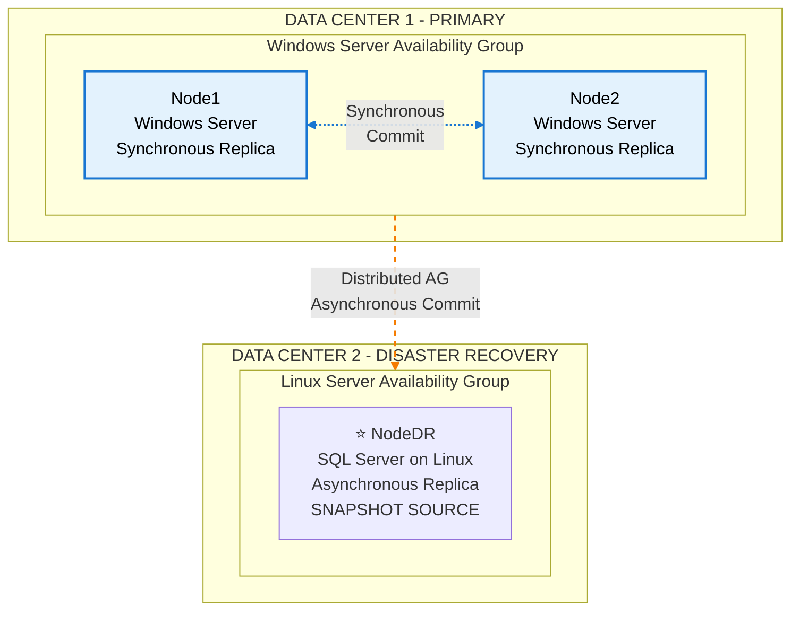

## Introduction 

### Prepare database for the CI/CD test environment of the developers instantly and efficiently

Seamlessly prepare the read/write development environment for the developing teams. 

The project's main framework of action is to participate in the Dev environments to dynamically create DBMS snapshots at the trigger of the development teams.

It has achieved the following main objectives:

#### 1. Time saver:

Makes Terabytes of the latest data and schema available to the developers in a
matter of seconds in the form of SaaS (DBaaS).

#### 2. Space saver:

The data size footprint for creating the test environment databases is minimal, with
an initial size of multiple Megabytes for a Multiple Terabytes production database,
while still all the data is accessible.

#### 3. Latest data/schema:

As the snapshots are triggered live from a production environment replica by the developers themselves and
 the process is also fast, the developers can get their hands on a test-copy of the production database in no time
 by skipping: 
 
* access restriction issues to the original database or its backups
* submitting requests to the Database Administration teams and human latency and bureaucracy. The DBAs in turn 
 might also face some limitations and concerns with respect to the disk space in the event of restoring large
 databases on the target and need to delete old data more frequently which increases their friction with the
 infrastructure operations and developer teams.
* long and strenuous large database restore times

#### 4. Almost zero production load

Bringing production snapshots to the test environment and running a developer-heavy
test workload does not affect the performance of the production major replicas, as the disaster
replica is serving the snapshots.

#### 5. Whole process management

The project supports executing any custom scripts before and after taking the snapshots to tailor bringing up
 the snapshots to the development team needs. 

* The documents and scripts **are not yet published on a public repository**, because of the team's policy.
