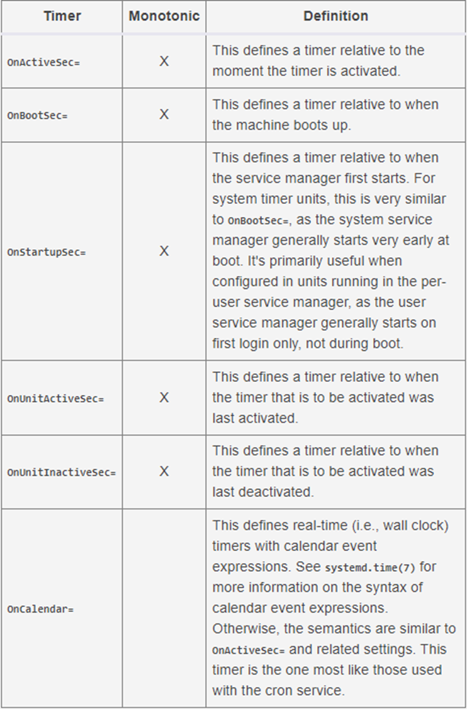
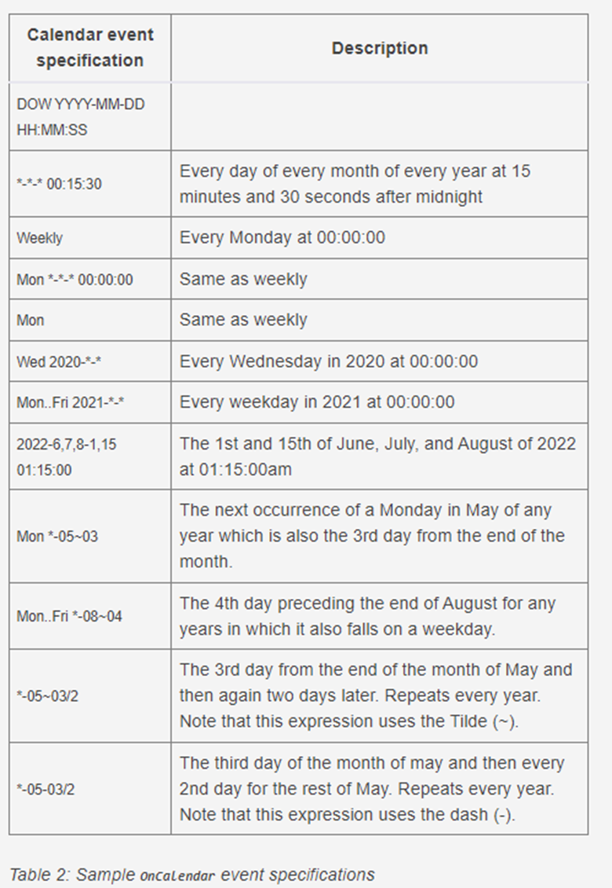
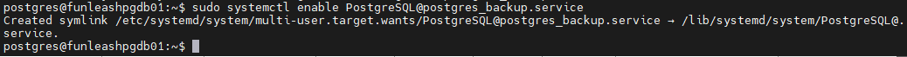

# Setup managed systemd jobs triggered by systemd timers

Note:

* Some of the very few directives are for RHEL (Red Hat Enterprise Linux). For example syslog.target exists in RHEL. Overall, this document is nearly identical for all Linux Distros which have systemd. (Ex: Debian, RHEL, etc.)
* For the unit files (services, timers, targets etc.) you can create the file under one of these paths:

  `/lib/systemd/system/`

  `/etc/systemd/system/`

1) create service file in /etc/systemd/system/ for your task
   (which is to be scheduled)

```shell
sudo vi /lib/systemd/system/pgbt.service
```

or

```shell
sudo vi /etc/systemd/system/pgbt.service
```

2) paste something like the following inside:

```shell
# /etc/systemd/system/pgbt.service


[Unit]
Description=PG13 backup service triggered by timer
#Documentation='No documentation for now'
After=syslog.target
After=network.target
After=multi-user.target
After=sshd.service
After=postgresql-13.service
Wants=pgbt.timer

[Service]
Type=oneshot

User=postgres
Group=postgres

Environment=PGDATA=/data/postgres13/data/
Environment=PGLOG=/var/log/pgsql/
Environment=SCHOME=/data/scripts/
WorkingDirectory=/data/scripts/

# Where to send early-startup messages from the server
# This is normally controlled by the global default set by systemd
StandardOutput=syslog

# Disable OOM kill on the scripts
OOMScoreAdjust=-1000
Environment=PGB_OOM_ADJUST_FILE=/proc/self/oom_score_adj
Environment=PGB_OOM_ADJUST_VALUE=0

ExecStart=/bin/bash /data/scripts/postgres_backup.sh

[Install]
WantedBy=multi-user.target


```

* in step 2 under unit you should add after which units you want this service to load.
* in step 2 under unit you should add which timer is to trigger this service
* in step 2 under service you should specify type 'oneshot' for Type directive if you need to specify
  multiple **ExecStart** tags to be executed serially
* in step 2 under service you should add user and group with which the service is to be executed
* in step 2 under service you should add environment variables
* in step 2 under service you should disable OOM kill on the scripts
* in step 2 under service you should add **ExecPre** tags to be executed before the ExecStart tag
  serially. Multiple ones can be specified
* in step 2 under service you should specify ExecStart like what you see. Multiple ones are allowed because
  Type is “oneshot”
* in step 2 under service you should specify **ExecPost** like what you see. Multiple ones are
  allowed.
* in step 2 under Install you should add the target multi-user.target because this task is to be run by this
  target

**- Some definitions:**

| ExecStartPre=, ExecStartPost= |
| :---------------------------- |

Additional commands that are executed before or after the command in `ExecStart=`, respectively. If any of those commands (not prefixed with "-") fail, by default, the rest are not executed and the unit is considered failed. Anyways, you can say to systemd what exit codes you consider success or pass for one of the `Exec` directives like below:

`SuccessExitStatus=0 1 2`  (Consider success/pass if any of these exit codes where returned)

| ExecStart= |
| :--------- |

main commands or scripts

`ExecStartPost=` commands are only run after the commands specified in `ExecStart=` have been invoked successfully, as determined by Type.

| ExecCondition= |
| :------------- |

Optional commands that are executed before the command(s) in `ExecStartPre=`. Syntax is the same as for `ExecStart=`, except that multiple command lines are allowed and the commands are executed one after the other, serially

3) create timer:

```shell
sudo vi /lib/systemd/system/pgbt.timer
```

```shell
# Timer for the service

[Unit]
Description=Executes backup operation
Requires=PostgreSQL@postgres_backup.service

[Timer]
Unit=PostgreSQL@postgres_backup.service
OnCalendar=*-*-* 23:00:00
AccuracySec=1us

[Install]
WantedBy=timers.target

```

* in step 3 under unit
  specify the dependant service
* in step 3 under Timer
  specify the dependant service
* in step 3 under Timer
  specify the desired schedule. Here is a list of available schedules:



* We want `OnCalendar` type,
  here is a list of available calendar events:



other sample schedules:

```shell
# every 10 minutes
OnCalendar=*:0/10
# every 10 seconds
OnCalendar=*:*:0/10
```

* in step 3 under Timer
  specify the AccuracySec tag. list of available accuracies:

  * usec, us, µs
  * msec, ms
  * seconds, second, sec, s
  * minutes, minute, min, m
  * hours, hour, hr, h
  * days, day, d
  * weeks, week, w
  * months, month, M (defined as 30.44 days)
  * years, year, y (defined as 365.25 days)
* in step 3 under Install specify the `timers.target`

Start the service once in order to test it.

```shell
systemctl start pgbt.service
```

```enable
systemctl enable pgbt.timer
```

4) For service template instead of service, create service file `<Service Template Name>@.service` like '/etc/systemd/system/backup@.service' and
   paste the following inside:

```shell
# /etc/systemd/system/backup@.service


[Unit]
Description= backup service triggered by timer executing %I
#Documentation='No documentation for now'
After=syslog.target
After=network.target
After=multi-user.target
After=sshd.service
After=postgresql-13.service
Wants=pgbt.timer

[Service]
Type=oneshot

User=postgres
Group=postgres

Environment=PGDATA=/data/postgres13/data/
Environment=PGLOG=/var/log/pgsql/
Environment=SCHOME=/data/scripts/
WorkingDirectory=/data/scripts/

# Where to send early-startup messages from the server
# This is normally controlled by the global default set by systemd
StandardOutput=syslog

# Disable OOM kill on the scripts
OOMScoreAdjust=-1000
Environment=PGB_OOM_ADJUST_FILE=/proc/self/oom_score_adj
Environment=PGB_OOM_ADJUST_VALUE=0

ExecStart=/bin/bash /data/scripts/%i

[Install]
WantedBy=multi-user.target

```

%i and %I

are variables holding the value passed to the service template's argument. %i is literal,
meaning it is exactly the value that is written in front of @ in "`servicet@arg-1.service`". Though %I replaces - with / (hyphen with forward slash).

* pass script's name as an
  argument to the following command if you want to run it once

| systemctl start servicet@`<script name>`.service |
| :------------------------------------------------- |

also:

| systemctl enable servicet@`<script name>`.service |
| :-------------------------------------------------- |

sample output:



Inside the timer specify the service with argument.

**Notes:**

* when you modify a unit, run 'systemctl daemon-reload' to reload the modifications
* If you do not want an ordinary (vs service template) service to run at startup, do not enable it.
  The enabled timer triggers even the disabled ordinary services. The
  timer may start the service at startup anyway if the scheduled time is
  relative. If the timer is set to a service template though, the service
  template has to be enabled.
* If you stop an enabled timer, it will start on its own again after some time even without reboot. To
  prevent a timer from working at all you must disable it.

**References:**

1. [https://www.freedesktop.org/software/systemd/man/systemd.service.html](https://www.freedesktop.org/software/systemd/man/systemd.service.html)
2. [https://www.freedesktop.org/software/systemd/man/systemd.unit.html](https://www.freedesktop.org/software/systemd/man/systemd.unit.html)
3. [https://www.freedesktop.org/software/systemd/man/systemd.timer.html](https://www.freedesktop.org/software/systemd/man/systemd.timer.html)
4. [https://opensource.com/article/20/7/systemd-timers](https://opensource.com/article/20/7/systemd-timers)
5. [https://fedoramagazine.org/systemd-template-unit-files/](https://fedoramagazine.org/systemd-template-unit-files/)

6) [https://blog.dcycle.com/blog/112/systemd-replacement-cron-every-10-seconds/](https://blog.dcycle.com/blog/112/systemd-replacement-cron-every-10-seconds/)
7) [https://stackoverflow.com/questions/48195340/systemd-with-multiple-execstart](https://stackoverflow.com/questions/48195340/systemd-with-multiple-execstart)

Finish ■
